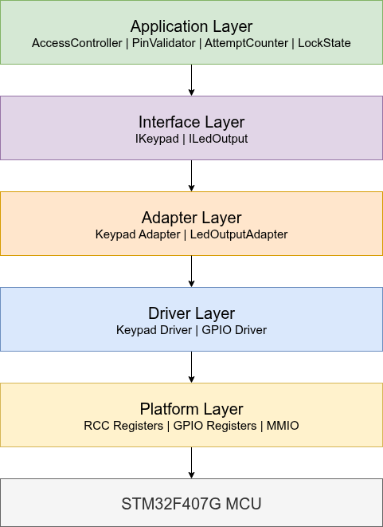
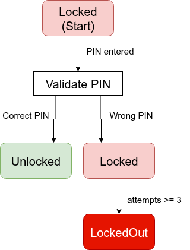

# System Architecture

## Overview

The STM32F407 Register-Level Access Control System follows a layered software architecture.

The main goal is to separate hardware-specific code from application logic.

The application layer is hardware independent and communicates with the STM32 peripherals through interfaces, adapters, and drivers.

This separation improves:

- maintainability
- testability
- hardware abstraction
- understanding of embedded system design

---

## Architecture Diagram



---

# Layer Description

## Application Layer

The application layer contains the system logic of the access control system.

Components:

- `AccessController`
- `PinValidator`
- `AttemptCounter`
- `LockState`

Responsibilities:

- processing user input
- validating PINs
- managing authentication states
- handling failed attempts
- controlling system behaviour

The application layer does not directly access STM32 registers or hardware peripherals.

---

## Access Controller State Machine

The AccessController is implemented as a finite state machine.

The controller manages the authentication process through three main states:

- Locked
- Unlocked
- LockedOut

The state transitions are triggered by PIN input and authnetication results.



## Interface Layer

The interface layer defines abstract hardware interfaces used by the application.

Interfaces:

- `IKeypad`
- `ILedOutput`

Responsibilities:

- provide hardware-independent access to input and output functionality
- allow application testing without real hardware

The application only depends on these interfaces.

---

## Adapter Layer

The adapter layer connects the application interfaces with the hardware-specific drivers.

Components:

- `KeypadAdapter`
- `LedOutputAdapter`

Responsibilities:

- implement application interfaces
- translate application requests into driver calls
- isolate hardware details from application logic

Example:

The application requests:

`leds.Green();`

The adapter translates this into a hardware-specific operation using the LED driver.

---

## Driver Layer

The driver layer provides low-level access to peripherals.

Components:

- GPIO driver
- Keypad driver

Responsibilities:

- configure peripherals
- read input signals
- control output signals
- perform hardware operations

The driver layer communicates directly with the platform layer.

---

## Platform Layer

The platform layer represents the STM32F407 hardware.

Components:

- GPIO register definitions
- RCC register definitions
- memory-mapped peripheral definitions

Responsibilities:

- provide access to MCU registers
- define hardware addresses
- describe peripheral structures

This layer contains the lowest-level hardware representation.

---

# Dependency Direction

The dependency direction follows a strict downward flow:

```text
Application  
↓  
Interfaces  
↓  
Adapters  
↓  
Drivers  
↓  
Platform  
↓  
STM32F407 Hardware
```

Higher layers do not directly depend on lower-level hardware details.

---

# Design Decisions

## No STM32 HAL

The project intentionally avoids STM32 HAL and CubeMX generated code.

Reasons:

- understand MCU internals
- learn register-level programming
- control the complete software stack

---

## Hardware Abstraction

Hardware access is separated from application logic.

Benefits:

- application code can be tested on a host system
- hardware components can be replaced
- software structure remains maintainable

---

## Module Interaction

The main application flow is:

```text
User Input  
→ Keypad Driver  
→ KeypadAdapter  
→ AccessController  
→ PinValidator / AttemptCounter  
→ LedOutputAdapter  
→ GPIO Driver
```

The AccessController coordinates the authentication process and uses interfaces to communicate with hardware-dependent components.

## Testable Application Design

The application layer uses interfaces instead of concrete hardware implementations.

This allows the use of mocks during unit testing.

Example:

```text
AccessController  
↓  
IKeypad  
↓  
MockKeypad
```

The access control logic can therefore be tested without an STM32 connected.
