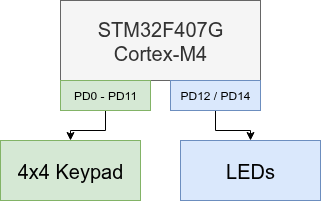

# Hardware Overview

## Target Platform

The project is implemented on the STM32F407G-DISC1 development board.

Main hardware components:

- STM32F407VG microcontroller
- ARM Cortex-M4 core
- ST-LINK debug interface
- On-board user LEDs
- 4x4 matrix keypad

The firmware directly accesses the MCU peripherals through memory-mapped registers.

---

## Hardware Block Diagram

The system consists of the STM32F407 microcontroller connected to external input and output components.

---

## Components

### STM32F407G-DISC1

The STM32F407G-DISC1 is the main processing unit of the system.

It provides:

- execute the access control firmware
- handle keypad input
- control LED output
- provide debugging and programming interface through ST-LINK

---

### 4x4 Matrix Keypad

The keypad provides user input for PIN authentication.

The keypad is connected using a matrix layout:

- 4 row signals
- 4 column signals

The firmware scans the keypad matrix by activating rows and reading column states.

Connection details:

| Signal | MCU Pin |
|---|---|
| Row 1 | PD0 |
| Row 2 | PD1 |
| Row 3 | PD2 |
| Row 4 | PD3 |
| Column 1 | PD8 |
| Column 2 | PD9 |
| Column 3 | PD10 |
| Column 4 | PD11 |

More details about the keypad wiring and pin assignment can be found here:

[Keypad Connection](keypad_connection.md)

---

### LED Output

The system uses the on-board LEDs for status feedback.

| Function | MCU Pin | Behaviour |
|---|---|---|
| Green LED | PD12 | Valid PIN |
| Red LED | PD14 | Invalid PIN |
| Red LED blinking | PD14 | Lockout state |

---

## Debug Interface

The board uses the integrated ST-LINK interface for programming and debugging.

Used tools:

- ST-LINK
- OpenOCD
- GDB

The debug interface allows:

- firmware flashing
- breakpoints
- variable inspection
- peripheral register inspection

---

## Hardware Design Notes

The project intentionally uses direct register-level access instead of STM32 HAL.

This provides:

- direct control over MCU peripherals
- explicit memory-mapped hardware access
- minimal hardware abstraction layers
- clear separation between hardware and application logic