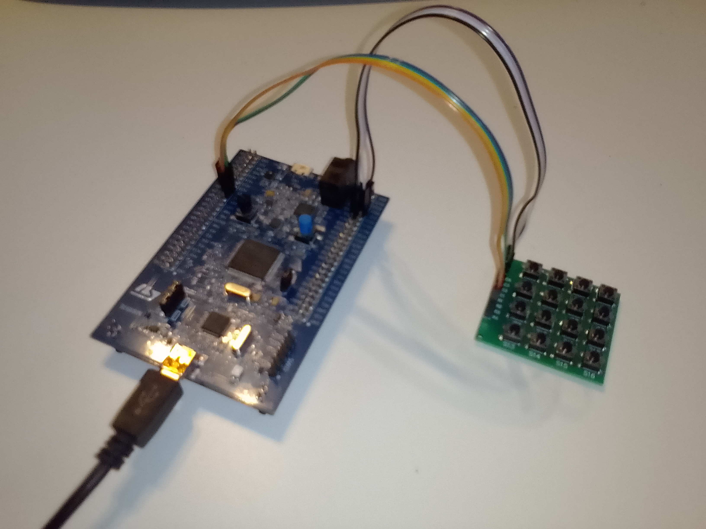

# STM32F407 Register-Level Access Control System

Bare-metal STM32F407 access control system implemented without HAL or CubeMX, focusing on register-level hardware access, embedded architecture and testable application design.

## Demo

A short demonstration of the access control system running on real hardware:

[Watch the demo video](Docs/video/demo_small.mp4)

## Target Hardware



- STM32F407G-DISC1
- ARM Cortex-M4
- 4x4 Matrix Keypad
- On-board LEDs (Green LED / Red LED)

The firmware directly controls the MCU peripherals through register-level access.

A detailed description of the hardware setup, connections and pin assignments can be found here:

[Hardware Overview](Docs/hardware.md)

<br clear="right"/>

## Toolchain

The project is built using a minimal toolchain consisting of:

- arm-none-eabi-gcc
- CMake
- ST-LINK
- OpenOCD
- gdb-multiarch (Ubuntu) or arm-none-eabi-gdb
- GNU Make

## Build

The project provides a Makefile as the main entry point.

Show available commands:
```bash
make help
```

### Build Firmware
```bash
make firmware
```

### Build and run host tests
```bash
make tests
```

## Flash and Debug

### Flash firmware
```bash
make flash
```

### Start OpenOCD
```bash
make openocd
```

### Start GDB
```bash
make gdb
```

More details about startup and memory layout:

[Startup Code](Docs/startup.md)  
[Linker Script](Docs/linker-script.md)

## Features

The firmware provides a complete PIN-based access control system:

- register-level GPIO programming
- custom keypad input driver
- PIN authentication
- failed attempt tracking and lockout protection
- LED-based status feedback
- host-based unit tests for application logic

## Architecture

A layered architecture separates hardware-specific code from application logic.

The main components are:

- Application layer: AccessController, PinValidator, AttemptCounter
- Hardware interfaces: IKeypad, ILedOutput
- Hardware adapters: KeypadAdapter, LedOutputAdapter

The application layer does not directly access STM32 registers.

A detailed description of the architecture and design decisions can be found in the [Architecture Documentation](Docs/architecture.md).

## Technical Concepts

- Memory-Mapped I/O
- Pointer Casting
- Bitwise Operations
- Struct-Based Register Mapping
- Volatile Qualifier
- Embedded Driver Architecture
- State Machine Design
- Layered Software Architecture
- Hardware Abstraction
- Dependency Inversion
- Unit Testing with Mocks

Details about the MCU register mapping:

[Register Map](Docs/register_map.md)

## Project Summary

The project has been completed and validated on real hardware.

The STM32F407-based access control system implements register-level hardware control, a layered software architecture, host-based unit tests and hardware debugging using ST-LINK, OpenOCD and GDB.